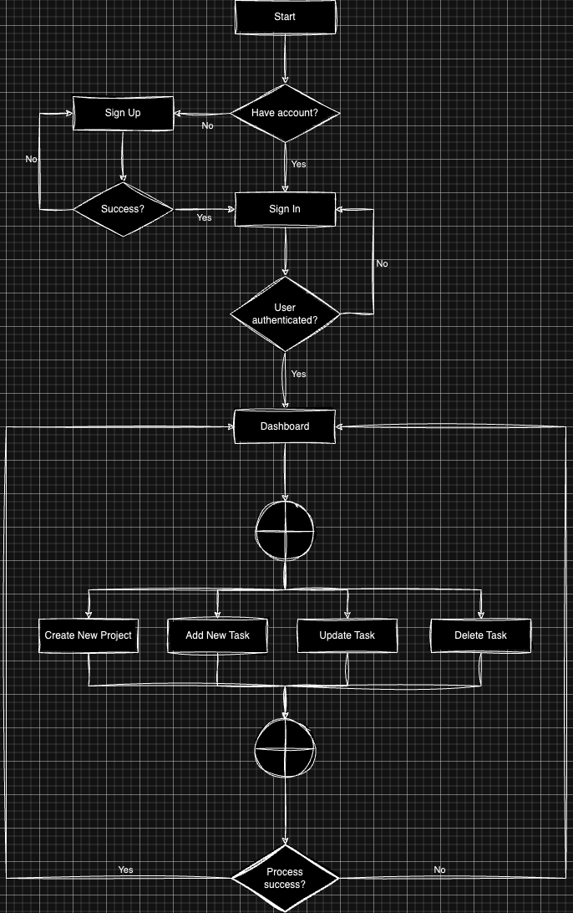
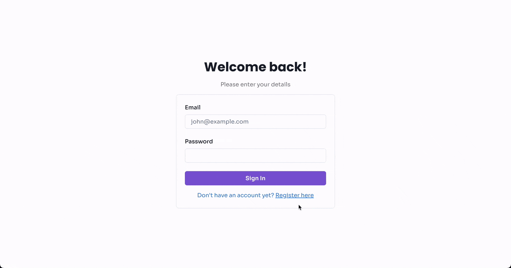

# Final Project Web Development

## IMPORTANT TO READ!
> This project is very dependent on [Final Project Linux & Container](https://github.com/syaifulhuseinnn/pacmann-final-linux-container). You must clone both to your local computer and place them into same folder.

## Background Problem

Ridwan seorang project manager suatu perusahaan, ingin mengetahui progress task yang dilakukan oleh bawahannya. Oleh karena itu, dia meminta Bima yang seorang Web Developer membuat sebuah Todo App sederhana untuk memantau kinerja dari karyawan, Ridwan mendiskusikan fungsionalitas dari Todo App tersebuat bersama Bima, dimana Ridwan menginginkan Todo App tersebut memiliki beberapa fungsi seperti:

- Karyawan dapat melakukan authentication sebelum masuk ke homepage Todo App
- Pada Todo App, karyawan dapat membuat sebuah task yang berhubungan dengan project yang mereka kerjakan
- Pada Todo App, terdapat tombol untuk menambahkan task baru
- Pada Todo App, terdapat action button untuk melakukan tambah, edit, dan menandai task selesai
- Selain itu karyawan dapat menambahkan project baru pada App
- Tiap task akan memiliki tag yang memberikan informasi task tersebut dibawah project apa
- Terdapat sebuah button untuk mengganti project pada app

## Requirements

1. User dapat melakukan login pada halaman login
2. Jika berhasil, User akan diarahkan ke halaman utama Todo App
3. User dapat menambahkan task baru dengan cara klik tombol _Add New Task_ dan sebuah Modal berisi form akan muncul
4. User dapat merubah task yang sudah ada dengan cara klik tombol _Update Task_ dan sebuah Modal berisi form akan muncul serta nilai awal dari task tersebut sudah terisi pada masing-masing input field
5. User dapat menghapus task dengan cara klik tombol _Delete Task_ dan sebuah Confirmation Alert akan muncul
6. User dapat menambahkan project baru dengan cara klik tombol _Create New Project_ dan sebuah Modal berisi form akan muncul
7. Terdapat sebuah menu untuk merubah project, untuk menyeleksi setiap task berdasarkan project

## Flowchart


## Technologies
1. Flask
2. PostgresSQL
3. React
4. TypeScript
5. Vite
6. Docker

## Preview Functions and Attributes

### Backend API
1. Define User, Project, and Task Model
```python
# Define the User, Project, and Task models

class User(db.Model):
    __tablename__ = 'user_accounts'
    user_id = db.Column(UUID(as_uuid=True), primary_key=True,
                        server_default=text("uuid_generate_v4()"))
    email = db.Column(db.String(255), nullable=False)
    password = db.Column(db.String(255), nullable=False)
    projects = db.relationship('Project', backref='user', lazy=True)


class Project(db.Model):
    __tablename__ = 'projects'
    project_id = db.Column(UUID(as_uuid=True), primary_key=True,
                           server_default=text("uuid_generate_v4()"))
    title = db.Column(db.String(255), nullable=False)
    user_id = db.Column(UUID(as_uuid=True), db.ForeignKey(
        'user_accounts.user_id', ondelete='CASCADE'), nullable=False)
    tasks = db.relationship('Task', backref='project', lazy=True)


class Task(db.Model):
    __tablename__ = 'tasks'
    task_id = db.Column(UUID(as_uuid=True), primary_key=True,
                        server_default=text("uuid_generate_v4()"))
    description = db.Column(db.Text, nullable=False)
    status = db.Column(db.Enum('todo', 'doing', 'done'),
                       default='todo', nullable=False)
    project_id = db.Column(UUID(as_uuid=True), db.ForeignKey(
        'projects.project_id', ondelete='CASCADE'), nullable=False)
    user_id = db.Column(UUID(as_uuid=True), db.ForeignKey(
        'user_accounts.user_id', ondelete='CASCADE'), nullable=False)
```

2. Create User

```python
# Endpoint to create a new user (POST)

@app.route('/signup', methods=['POST'])
def create_user():
    try:
        # Other codes here

        return response

    except DataError as e:
        return error
    except IntegrityError as e:
        return error
```

3. Get User Info for Sign In

```python
# Endpoint to retrieve user information based on email and password (GET)


@app.route('/users', methods=['POST'])
def get_user_info():
    try:
        # Other codes here

        return response

    except DataError as e:
        return error
```

4. Get Project List

```python
# Endpoint to retrieve projects based on user_id


@app.route('/projects/<user_id>', methods=['GET'])
def get_projects(user_id):
    try:
        # Other codes here
        
        return response

    except DataError as e:
        return error
```

5. Create New Project

```python
# Endpoint to create a new project for a user (POST)


@app.route('/projects/<user_id>', methods=['POST'])
def create_project(user_id):
    try:
        # Other codes here
        
        return response

    except DataError as e:
        return error
```

6. Update Existing Project

```python
# Endpoint to update a project and its tasks (PUT)


@app.route('/projects/<user_id>', methods=['PUT'])
def update_project(user_id):
    try:
        # Other codes here
        
        return response

    except DataError as e:
        return error
```

7. Delete Project

```python
# Endpoint to delete a project and its tasks or specific tasks (DELETE)


@app.route('/projects/<user_id>', methods=['DELETE'])
def delete_project(user_id):
    try:
        # Other codes here
        
        return response

    except DataError as e:
        return error
```

8. Create New Task

```python
# Endpoint to create new task based on user_id and project_id


@app.route('/tasks/<user_id>', methods=['POST'])
def create_task(user_id):
    try:
        # Other codes here
        
        return response

    except DataError as e:
        return error
```

9. Update Task

```python
# Endpoint to update a task based on user_id, project_id, and task_id


@app.route('/tasks/<user_id>', methods=['PUT'])
def update_task(user_id):
    try:
        # Other codes here
        
        return response

    except DataError as e:
        return error
```

10. Delete Task

```python
# Endpoint to delete a task based on user_id, project_id, and task_id


@app.route('/tasks/<user_id>', methods=['DELETE'])
def delete_task(user_id):
    try:
        # Other codes here
        
        return response

    except DataError as e:
        return error
```

### Frontend

1. Hit Get Project List Endpoint

```typescript
const getProjects = async (userId: string) => {
  try {
    const response = await services.get(`/projects/${userId}`);
    return response.data;
  } catch (error: any) {
    return error.response.data;
  }
};
```

2. Hit Add New Task Endpoint

```typescriptreact
const addNewTask = async (
  userId: string,
  projectId: string,
  task: { description: string; status: string }
): Promise<NewTaskResponse> => {
  try {
    const response = await services.post(`/tasks/${userId}`, {
      project_id: projectId,
      task: task,
    });
    return response.data;
  } catch (error: any) {
    return error.response.data;
  }
};
```

3. Hit Update Task Endpoint

```typescriptreact
const updateTask = async (
  userId: string,
  projectId: string,
  task: {
    task_id: string;
    description: string;
    status: "todo" | "doing" | "done";
  }
): Promise<UpdateTaskResponse> => {
  try {
    const response = await services.put(`/tasks/${userId}`, {
      project_id: projectId,
      task: task,
    });
    return response.data;
  } catch (error: any) {
    return error.response.data;
  }
};
```

4. Hit Delete Task Endpoint

```typescriptreact
const deleteTask = async (
  userId: string,
  projectId: string,
  taskId: string
) => {
  try {
    const response = await services.delete(`/tasks/${userId}`, {
      data: {
        project_id: projectId,
        task_id: taskId,
      },
    });
    return response.data;
  } catch (error: any) {
    return error.response.data;
  }
};
```

5. Hit Create New Project Endpoint

```typescriptreact
const createNewProject = async (
  userId: string,
  title: string
): Promise<NewProjectResponse> => {
  try {
    const response = await services.post(`/projects/${userId}`, {
      title: title,
    });
    return response.data;
  } catch (error: any) {
    return error.response.data;
  }
};
```

## Demo

### Sign In


### Sign Up


### Create New Project


### Add New Task


### Update Task


### Delete Task


## Conclusion

Build REST API using Flask is the new experience for me. I'm only experience in JavaScript all this time. This project improve my skills in Python and SQL.